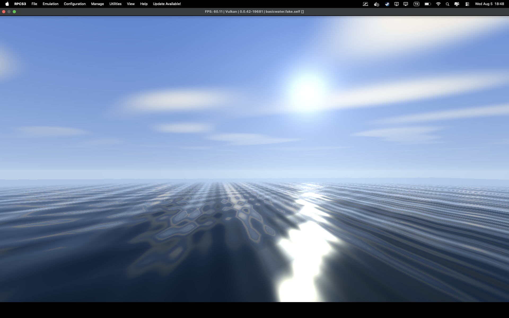

# PS3 Homebrew Oyunlari

PlayStation 3 icin PSL1GHT ile yazilmis homebrew oyunlar.
Gelistirme ortami tamamen Docker icindedir — host makineye SDK, derleyici veya
kutuphane kurulmaz. Apple Silicon uzerinde native (arm64) calisir.

## Projeler

### [Ping Pong](Ping-Pong/) — calisir durumda

Menulu, tam oynanabilir bir ping pong oyunu.

- Turkce menu (Baslat / Hakkinda / Cikis), bota karsi ve 2 kisilik mod
- 11 sayilik mac, duraklatma, kazanan ekrani
- Orta zorlukta bot yapay zekasi (topu takip eder ama yenilebilir)
- Analog cubukla orantili raket hizi, yon tuslariyla tam guc
- Koda gomulu 8x8 bitmap font; Turkce glifler (g G i I s S) elle cizildi
- Arkaplan gorseli destegi (derleme sirasinda ham piksele cevrilip gomulur)
- 29 birim testi

### [Basic Water](Basic-Water/) — calisir durumda

3D deniz ve gokyuzu sahnesi, serbest ucan kamera. Bir flight simulator'un ilk
adimi olarak tasarlandi.



*RPCS3'te 60 FPS. Goruntudeki hicbir sey hazir doku degil; gokyuzu, gunes,
bulutlar ve su tamamen shader'da hesaplaniyor.*

- **Gokyuzu:** ufuktan zenite gradyan, gunes diski ve halesi, ruzgarla suzulen
  bulutlar (prosedurel desen, texture yok)
- **Su:** iki buyuk dalga geometride, iki ince dalga piksel basina normal
  olarak; Fresnel'e bagli gokyuzu yansimasi, gunes parlamasi, mesafe sisi
- **Kamera:** serbest ucus, su yuzeyinin altina inemez
- 30 birim testi (matris, kamera, carpisma)

Gokyuzu ve su formullerinin C karsiliklari (`source/skycolor.c`,
`source/waves.c`) shader'larla birebir ayni tutulur; `tests/scene_preview.c`
bunlari host'ta isin atarak render eder, boylece sahne konsola gitmeden
dogrulanabilir.

## Derleme

Her iki projede de:

```sh
./build.sh          # .self + .pkg uretir
./build.sh test     # birim testleri
./build.sh clean    # ciktilari temizler
```

Gereken tek sey Docker. Ilk calistirmada toolchain imaji indirilir
(`zeldin/ps3dev-docker`, ~400 MB, tek seferlik).

Ciktilar:

| Dosya | Kullanim |
|---|---|
| `*.fake.self` | RPCS3 emulatoru — File > Boot SELF/ELF |
| `*.pkg` | Gercek PS3 (CFW) — USB'den kurulum |

## Gorsel dogrulama

Her iki proje de cizim katmanini host tarafinda calistirip PNG uretebiliyor;
boylece ekran yerlesimi ve kamera matematigi emulatore gitmeden dogrulanabiliyor.
Detaylar proje README'lerinde.

## Notlar

- Font tablolari: [dhepper/font8x8](https://github.com/dhepper/font8x8) (public domain)
- Toolchain: [PSL1GHT](https://github.com/ps3dev/PSL1GHT) + [ps3toolchain](https://github.com/ps3dev/ps3toolchain)
