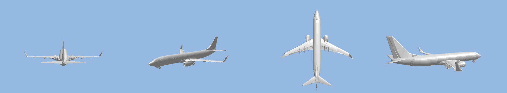
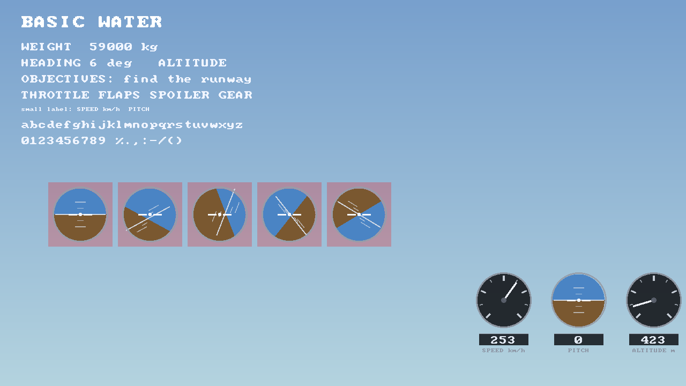

# Basic Water — a flight simulator for the PlayStation 3

A flight simulator running on real PS3 hardware, written with PSL1GHT against
the RSX directly. No engine, no middleware: the renderer, the flight model, the
audio synthesis and the asset pipeline are all in this repository.

The entire toolchain lives in Docker — nothing is installed on your machine.
One command produces a `.pkg` you can install on a CFW console.


*Running in RPCS3. Sky, sun, clouds and water are computed in the shader —
none of it is a pre-made texture.*

## Download

Pre-built packages are attached to the [latest release](../../releases/latest).

| File | Use |
|---|---|
| `basicwater.pkg` | Real PS3 (CFW/HEN) — Package Manager → Install Package Files |
| `basicwater.fake.self` | RPCS3 — File → Boot SELF/ELF |

Packages are verified before release: the exact `EBOOT.BIN` inside the `.pkg`
is booted in RPCS3 and checked against the game's own diagnostic log.

## What works

**Flight model** — lift, drag and stall from dynamic pressure and angle of
attack, tuned to a Boeing 737-800: 41 t empty, 125 m² wing, 235 kN thrust,
rotation at 75 m/s. Angular inertia means the aircraft has weight; body rates
are converted to Euler rates properly, so pulling back in a bank turns the
aircraft instead of dropping the nose. Trim accounts for the lift lost to bank.
Control authority scales with dynamic pressure — a parked aircraft ignores the
stick.

**Aircraft** — every moving surface is a separate part: flaps, ailerons,
spoilers, rudder, landing gear with doors, engine fans, cabin doors. Surfaces
travel to the commanded position at their own rate rather than snapping to it:
flaps take about fifteen seconds to run out, speedbrakes about two. The wheels
spin with ground speed.



**Environment** — procedural sky with sun and drifting clouds, water with
per-pixel wave normals and Fresnel-weighted reflection, weather (clear,
cloudy, rainy, foggy, stormy) and time of day, two runways 2600 m long.

**Instruments** — airspeed, altitude, artificial horizon, throttle lever,
minimap, objectives, and STALL / OVER G / LOW FUEL warnings with audio.



*The HUD, rasterised on the host exactly the way the GPU does it — pixel-centre
coverage, MSAA off — so half-pixel geometry that would vanish on console is
caught before it ships.*

**Autopilot** — holds altitude, heading and speed by producing stick input, so
it obeys the same physics you do. Holds altitude to within a metre. Releases
the moment you touch the stick.

**Audio** — engine, wind, sea, stall horn, gear and flap servos, wheel roll and
touchdown. All synthesised; there are no sound files.

**Cameras** — chase with a free orbit, cockpit, both wings, tail, and a
detached free camera.

## Controls

| Action | Pad | Keyboard (RPCS3 default) |
|---|---|---|
| **Fly** (pitch / roll) | **Right stick** (or D-pad) | arrow keys |
| **Orbit camera** | **Left stick** | W A S D |
| Zoom in / out | L3 / L3 + Triangle | F / F + V |
| Throttle up | R2 or R1 | T or E |
| Throttle down | L2 or L1 | R or Q |
| Flap notch | Square | Z |
| Speedbrake lever (half / full / in) | Triangle | V |
| Landing gear | Cross | X |
| Camera mode | Circle | C |
| Autopilot | R3 | G |
| Settings menu | Select | Space |
| Quit | Start | Enter |

**Taking off:** the aircraft starts stopped at the head of the runway, engine
at idle. Hold throttle until the on-screen strip says you have reached rotation
speed, then pull back on the right stick.

## Building

Docker is the only requirement.

```sh
./build.sh          # produces .self and .pkg
./build.sh test     # host-side test suites
./build.sh clean    # removes build outputs
```

Deploying to a console over the network:

```sh
./build.sh send <PS3_IP>   # upload the .pkg over FTP
./build.sh run <PS3_IP>    # run the .self directly via ps3load
./build.sh log <PS3_IP>    # fetch the on-console diagnostic log
```

Three one-off Docker images do the work, so nothing lands on the host:

| Image | Why |
|---|---|
| `zeldin/ps3dev-docker` (arm64) | ps3toolchain + PSL1GHT, native on Apple Silicon |
| `ps3-cgcomp` (amd64) | `cgcomp` needs the NVIDIA Cg Toolkit, which is x86-only |
| `ps3-assets` | Pillow and fontTools for texture and font conversion |

Shader output (`.vpo`/`.fpo`) is RSX microcode and architecture-independent, so
it is produced on amd64 and linked into the arm64 build.

## Assets

Models are converted at build time by `tools/glb_to_mesh.py` — pure Python, no
dependencies. Every moving surface is its own part, recognised by name prefix,
because real models split one surface across several panels
(`flap_left01..04`, `spoiler_right01..06`) that move together.

The in-repo default is `assets/model/jet.glb`, generated parametrically by
`tools/blender/build_aircraft.py` in headless Blender: 25 parts, 4280
triangles, ends capped, UVs unwrapped per part. It exists so the project builds
for anyone with no third-party asset.

Textures are CC0 from [ambientCG](https://ambientcg.com), converted to
RSX-ready ARGB with a full mip chain by `tools/make_textures.py`.

## Testing without a console

Hardware code (RSX, pad, audio) cannot be unit tested, so everything that can
be pure is pure and tested on the host:

| Suite | Covers |
|---|---|
| `test_flight` | lift, drag, stall in both directions, takeoff, runway collision, fuel |
| `test_autopilot` | altitude and heading hold, bank limits, stall protection |
| `test_camview` | camera aiming, orientation matrix, artificial horizon |
| `test_math` | matrices, projection, camera collision |
| `test_atmosphere` | weather and time-of-day combinations |
| `test_menu` | menu state machine |
| `test_mesh` | model file parsing against the real data file |

`build.sh test` also greps the source for two regressions that once shipped:
flight state being reset inside the main loop, and controls not being bound.

These are not decoration. The mesh test caught a silently rejected model twice
when the part limit was too low. The turn test caught a real defect in the
flight model at airliner mass. The camera test caught a sign error that put the
camera in front of the aircraft.

## Status

Early, and honest about it. Known problems are tracked one by one in the
[issue list](../../issues); the [roadmap](../../issues/2) has the whole
picture. Currently open: model quality, remaining gaps in flight dynamics,
instrument bugs, collision handling, graphics, and animation and audio.

The goal is a simulator that genuinely feels like flying: **airliners and
fighter jets**, eventually **playable online on CFW consoles**.

**Help is welcome in any form** — code, 3D models, sound recordings, testing on
real hardware, or simply saying what feels wrong when you fly it. Contributing
needs no SDK: `./build.sh` and you have a package.

Useful right now:

- **Aircraft models** (`.glb` / `.obj`, 20k–60k triangles, metres, nose along
  −Z) with control surfaces as separately named objects — see
  [#3](../../issues/3)
- **Sound recordings** (48 kHz 16-bit WAV, loopable 2–6 s) — see
  [#8](../../issues/8)

## History

This repository also contains a finished **Ping Pong** game, the first thing
built here. It now lives on the [`old`](../../tree/old) branch together with
the earlier two-project layout.

## License

MIT
